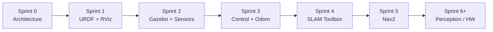

# ROS2 Autonomous Mobile Robot (AMR)

A portfolio-grade ROS2 engineering platform for a differential-drive autonomous mobile robot — from URDF modeling and Gazebo simulation through motion control, with SLAM and Nav2 navigation planned next.

Built incrementally in sprints, following **ROS2 Humble official examples** for controllers, SLAM, and navigation.

---

## Demo

> Place your screen recording under `docs/assets/` and update the paths below.

| Demo | Description | Asset |
|------|-------------|-------|
| Gazebo teleop | Keyboard drive in Gazebo Classic | `docs/assets/demo_teleop.gif` |
| RViz + LiDAR | Laser scan visualization | `docs/assets/demo_lidar.gif` |
| Full stack (future) | SLAM / Nav2 navigation | `docs/assets/demo_nav.gif` |

```markdown
<!-- Uncomment after adding assets -->
<!--  -->
<!--  -->
```

**Record a demo (Ubuntu):**

```bash
# Terminal 1
ros2 launch amr_gazebo gazebo.launch.py

# Terminal 2
ros2 launch amr_control cmd_vel_keyboard.launch.py

# Record with Peek, SimpleScreenRecorder, or OBS; export as GIF/MP4 → docs/assets/
```

---

## Current Status — Sprint 3 Completed

| Sprint | Focus | Status |
|--------|-------|--------|
| 0 | Repository & package architecture | **Complete** |
| 1 | URDF/Xacro model & RViz | **Complete** |
| 2 | Gazebo Classic + LiDAR + IMU | **Complete** |
| 3 | Motion control, teleop, odometry | **Complete** |
| 4 | SLAM Toolbox mapping | Planned |
| 5 | Nav2 autonomous navigation | Planned |
| 6+ | Perception, dashboard, hardware | Future |

### Sprint 3 deliverables

| Phase | Deliverable | Status |
|-------|-------------|--------|
| 1 | `ros2_control` + Gazebo plugin | Done |
| 2 | `joint_state_broadcaster` | Done |
| 3 | `diff_drive_controller` | Done |
| 4 | Keyboard teleop | Done |
| 5 | Odometry + `enable_odom_tf` | Done |

**Next milestone:** [Sprint 4 — SLAM Toolbox](docs/milestones.md#sprint-4--slam-mapping)

---

## Tech Stack

| Layer | Technology | Role |
|-------|------------|------|
| **Middleware** | [ROS2 Humble](https://docs.ros.org/en/humble/) | Core robotics framework |
| **OS** | Ubuntu 22.04 LTS | Target platform |
| **Simulation** | [Gazebo Classic](http://gazebosim.org/) | Physics + sensor simulation |
| **Robot model** | URDF / Xacro | Kinematic & visual description |
| **Control** | [ros2_control](https://control.ros.org/humble/) | Hardware abstraction & controller manager |
| **Controllers** | `joint_state_broadcaster`, `diff_drive_controller` | Joint states & differential drive |
| **Gazebo bridge** | [gazebo_ros2_control](https://control.ros.org/humble/doc/gazebo_ros2_control/doc/index.html) | Sim hardware interface |
| **Teleop** | `teleop_twist_keyboard` | Keyboard velocity commands |
| **SLAM** *(planned)* | [SLAM Toolbox](https://github.com/SteveMacenski/slam_toolbox) | 2D mapping |
| **Navigation** *(planned)* | [Nav2](https://navigation.ros.org/) | Autonomous path planning |
| **Visualization** | RViz2 | TF, laser, robot model |
| **Build** | colcon / ament_cmake | Workspace build |

---

## Implemented Features

### Robot model (Sprint 1)

- Differential-drive AMR: 0.50 × 0.40 × 0.12 m chassis, two drive wheels + front/rear casters
- REP-105 frames: `base_footprint`, `base_link`, `laser_link`, `imu_link`
- RViz visualization via `amr_bringup/display.launch.py`

### Simulation & sensors (Sprint 2)

- Gazebo Classic world with ODE physics tuning
- 2D LiDAR → `/scan` on `laser_link`
- IMU → `/imu` on `imu_link`
- Unified spawn via `robot_description` topic

### Motion control & odometry (Sprint 3)

- `gazebo_ros2_control` + official Humble `diff_drive_controller` configuration
- Sequential controller loading: `joint_state_broadcaster` → `diff_drive_controller`
- Keyboard teleop → `/diff_drive_controller/cmd_vel_unstamped`
- Wheel odometry → `/diff_drive_controller/odom`
- TF `odom` → `base_footprint` (`enable_odom_tf: true`)
- Gazebo stability: dual casters, contact/friction overlays, ground-level spawn

### ROS graph (current)

| Topic / TF | Name |
|------------|------|
| Velocity (teleop) | `/diff_drive_controller/cmd_vel_unstamped` |
| Odometry | `/diff_drive_controller/odom` |
| Joint states | `/joint_states` |
| LiDAR | `/scan` |
| IMU | `/imu` |
| TF chain | `odom` → `base_footprint` → `base_link` → sensors / wheels |

---

## Quick Start

**Prerequisites:** Ubuntu 22.04, ROS2 Humble, Gazebo Classic — see [docs/setup.md](docs/setup.md).

```bash
source /opt/ros/humble/setup.bash
cd ros2-autonomous-mobile-robot
colcon build --symlink-install
source install/setup.bash
```

**Terminal 1 — simulation + controllers:**

```bash
ros2 launch amr_gazebo gazebo.launch.py
```

**Terminal 2 — keyboard teleop:**

```bash
ros2 launch amr_control cmd_vel_keyboard.launch.py
# i/j/k/l — drive; q/z — speed; space — stop
```

**Optional — RViz (no Gazebo):**

```bash
ros2 launch amr_bringup display.launch.py
```

**Verify:**

```bash
ros2 control list_controllers          # both controllers active
ros2 topic hz /diff_drive_controller/odom
ros2 run tf2_ros tf2_echo odom base_footprint
```

---

## Project Structure

```
ros2-autonomous-mobile-robot/
├── docs/
│   ├── handoff.md           # Session handoff for new dev sessions
│   ├── architecture.md      # System design & data flow
│   ├── milestones.md        # Sprint plan & acceptance criteria
│   ├── setup.md             # Environment setup guide
│   ├── conventions.md       # Naming & contribution rules
│   └── assets/              # Demo GIFs / videos (add your recordings here)
├── src/
│   ├── amr_description/     # URDF/Xacro, RViz config          [Sprint 1 ✓]
│   ├── amr_bringup/         # Top-level launch entry points      [Sprint 1 ✓]
│   ├── amr_gazebo/          # Gazebo worlds, sensors, spawn      [Sprint 2 ✓]
│   ├── amr_control/         # ros2_control, teleop, odom         [Sprint 3 ✓]
│   ├── amr_slam/            # SLAM Toolbox                       [Sprint 4]
│   ├── amr_navigation/      # Nav2 stack                           [Sprint 5]
│   ├── amr_perception/      # Perception pipeline                  [Future]
│   └── amr_dashboard/       # Operator UI / monitoring             [Future]
├── LICENSE
└── README.md
```

Each package under `src/` has its own `README.md` with components and interfaces.

---

## Roadmap



| Sprint | Goal | Key deliverables |
|--------|------|------------------|
| **4** | 2D mapping | SLAM Toolbox config, online async SLAM, map save/load, TF `map` → `odom` |
| **5** | Autonomous navigation | Nav2 params, AMCL / localization, goal pose in RViz, obstacle avoidance |
| **6+** | Extensions | Depth perception, costmap layers, Foxglove dashboard, real robot drivers |

Details and acceptance criteria: [docs/milestones.md](docs/milestones.md)

---

## Documentation

| Document | Description |
|----------|-------------|
| [handoff.md](docs/handoff.md) | Latest progress, ROS graph, next tasks |
| [architecture.md](docs/architecture.md) | Package map & planned data flow |
| [setup.md](docs/setup.md) | Ubuntu 22.04 + ROS2 Humble setup |
| [milestones.md](docs/milestones.md) | Sprint tracking & acceptance criteria |
| [conventions.md](docs/conventions.md) | Naming, launch, and parameter conventions |

---

## Engineering Principles

- **Official templates first** — controllers, SLAM, and Nav2 configs copied from ROS2 Humble examples
- **Minimal diffs** — change only what the current sprint requires
- **Gazebo Classic** — Humble-compatible simulation (not Gazebo Harmonic)
- **REP-105 naming** — `base_footprint`, `base_link`, `odom`, `map`, `laser_link`

---

## License

MIT — see [LICENSE](LICENSE).
