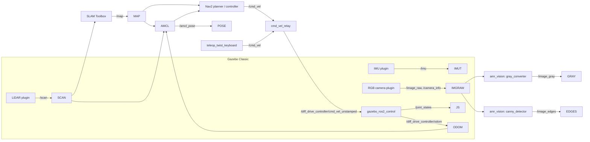

# ROS2 Autonomous Mobile Robot (AMR)

A differential-drive mobile robot simulation and control stack built on **ROS2 Humble**, **Ubuntu 22.04**, **Gazebo Classic**, and **RViz2**. The repository is developed as a long-term digital-twin and robotics research platform, progressing incrementally from a simulated kinematic model toward perception and, eventually, mobile manipulation.

## Demo

[YouTube](https://youtu.be/XBV4MKnJ9yI)

## Current Status

- **AMR V1 / V1.1** — complete (robot model, Gazebo simulation, `ros2_control` differential drive, teleop, odometry, SLAM, AMCL localization, Nav2 navigation, office world).
- **AMR V2 — Sprint 7 (Vision Perception Pipeline)** — complete, all four phases:
  - Phase 1 — RGB Camera Integration
  - Phase 2 — OpenCV Grayscale Conversion
  - Phase 3 — Gaussian Blur + Canny Edge Detection
  - Phase 4 — Combined Perception Pipeline + YAML Parameters
- `amr_vision` is currently a **standalone package**: it is not wired into `amr_bringup` or any shared/top-level launch file, and must be run separately.

## Completed Development Stages

| Stage | Scope |
|---|---|
| Sprint 0 | Workspace and package structure |
| Sprint 1 | URDF/Xacro and TF |
| Sprint 2 | Gazebo, LiDAR and IMU |
| Sprint 3 | `ros2_control`, differential drive, odometry and teleop |
| Sprint 4 | SLAM Toolbox and map saving |
| Sprint 5 | Map Server and AMCL localization |
| Sprint 6 | Nav2 autonomous navigation |
| V1.1 | Office world and project presentation |
| Sprint 7 Phase 1 | RGB camera integration |
| Sprint 7 Phase 2 | OpenCV grayscale image processing (`amr_vision`) |
| Sprint 7 Phase 3 | Gaussian blur + Canny edge detection (`amr_vision`) |
| Sprint 7 Phase 4 | Combined perception pipeline + YAML parameters (`amr_vision`) |

## Current Features

- Robot digital twin (URDF/Xacro, TF tree)
- Gazebo Classic simulation
- Differential-drive control (`ros2_control` + `gazebo_ros2_control`)
- Keyboard teleoperation
- Odometry
- LiDAR
- IMU
- RGB camera
- SLAM (SLAM Toolbox)
- Map saving
- AMCL localization
- Nav2 planning and navigation
- RViz2 visualization
- OpenCV grayscale image processing (standalone)
- Canny edge detection with configurable Gaussian blur / threshold parameters (standalone)
- Combined vision pipeline (grayscale + edge detection) with YAML-based parameter loading (standalone)

## System Architecture


```mermaid
flowchart LR
    subgraph Gazebo Classic
        LIDAR[LiDAR plugin] -->|/scan| SCAN
        IMUP[IMU plugin] -->|/imu| IMUT
        CAM[RGB camera plugin] -->|/image_raw, /camera_info| IMGRAW
        RC[gazebo_ros2_control] -->|/joint_states| JS
        RC -->|/diff_drive_controller/odom| ODOM
    end

    SCAN --> SLAM[SLAM Toolbox] -->|/map| MAP
    SCAN --> AMCL[AMCL]
    MAP --> AMCL
    ODOM --> AMCL
    AMCL -->|/amcl_pose| POSE
    MAP --> NAV2[Nav2 planner / controller]
    AMCL --> NAV2
    NAV2 -->|/cmd_vel| RELAY[cmd_vel_relay]
    TELEOP[teleop_twist_keyboard] -->|/cmd_vel| RELAY
    RELAY -->|/diff_drive_controller/cmd_vel_unstamped| RC

    IMGRAW --> GRAYNODE[amr_vision: gray_converter] -->|/image_gray| GRAY
    IMGRAW --> CANNYNODE[amr_vision: canny_detector] -->|/image_edges| EDGES
```

```text
/image_raw
├── gray_converter  → /image_gray
└── canny_detector  → /image_edges
```

`amr_vision` consumes `/image_raw` independently and is not part of the navigation control loop above. Both `amr_vision` nodes can run standalone or together via `perception.launch.py`.

## ROS2 Packages

| Package | Responsibility | Status |
|---|---|---|
| `amr_description` | URDF/Xacro robot model (base, wheels, caster, sensors, camera) | Complete |
| `amr_gazebo` | Gazebo Classic worlds, spawn, sensor and `ros2_control` plugins | Complete |
| `amr_control` | `ros2_control` YAML config, `cmd_vel_relay.py` bridge | Complete |
| `amr_slam` | SLAM Toolbox online mapping, map saving | Complete |
| `amr_navigation` | Map server, AMCL localization, Nav2 navigation | Complete |
| `amr_bringup` | Robot-model-only RViz display (no Gazebo) | Complete (minimal) |
| `amr_vision` | Standalone OpenCV image processing — grayscale, Canny edge detection, combined pipeline (`ament_python`) | Complete, not integrated into bringup |
| `amr_perception` | Future perception pipeline (costmap layers, camera-based perception) | Placeholder |
| `amr_dashboard` | Future operator dashboard (Foxglove / rosbridge) | Placeholder |

## Important Topics

| Topic | Published by |
|---|---|
| `/cmd_vel` | Teleop or Nav2, consumed by `cmd_vel_relay` |
| `/diff_drive_controller/cmd_vel_unstamped` | `cmd_vel_relay`, consumed by `diff_drive_controller` |
| `/joint_states` | `joint_state_broadcaster` |
| `/diff_drive_controller/odom` | `diff_drive_controller` |
| `/scan` | Gazebo LiDAR plugin |
| `/imu` | Gazebo IMU plugin |
| `/image_raw`, `/camera_info` | Gazebo RGB camera plugin |
| `/image_gray` | `amr_vision` (`gray_converter`) |
| `/image_edges` | `amr_vision` (`canny_detector`) |
| `/map` | SLAM Toolbox or `map_server` |
| `/amcl_pose` | `amcl` |

## Repository Structure

```text
robot_project/
├── src/
│   ├── amr_description/
│   ├── amr_gazebo/
│   ├── amr_control/
│   ├── amr_slam/
│   ├── amr_navigation/
│   ├── amr_bringup/
│   ├── amr_vision/
│   ├── amr_perception/
│   └── amr_dashboard/
├── docs/
│   ├── architecture.md, conventions.md, handoff.md,
│   │   milestones.md, setup.md, sprint3-freeze.md
│   └── development_logs/
├── maps/
├── scripts/
├── README.md
└── LICENSE
```

`build/`, `install/`, and `log/` are colcon-generated and not part of the tracked repository layout.

## Requirements

- Ubuntu 22.04
- ROS2 Humble
- Gazebo Classic
- `ros2_control` / `gazebo_ros2_control`
- SLAM Toolbox
- Navigation2 (Nav2)
- `cv_bridge`
- OpenCV (`python3-opencv`)

## Build Instructions

Native Ubuntu workspace (not a VMware/Windows shared folder):

```bash
cd /home/jinjing/robot_project
source /opt/ros/humble/setup.bash
rosdep install --from-paths src --ignore-src -r -y   # if rosdep is configured
colcon build --symlink-install
source install/setup.bash
```

## Usage

**Gazebo simulation:**

```bash
ros2 launch amr_gazebo gazebo.launch.py
# alternate world:
ros2 launch amr_gazebo gazebo.launch.py world:=office.world
```

**Gazebo + RViz (camera, LiDAR, robot model):**

```bash
ros2 launch amr_gazebo gazebo_rviz.launch.py
```

**Teleoperation** (with Gazebo already running; `cmd_vel_relay` is started automatically by `gazebo.launch.py`):

```bash
ros2 run teleop_twist_keyboard teleop_twist_keyboard
```

**SLAM mapping:**

```bash
ros2 launch amr_slam mapping.launch.py use_sim_time:=true
ros2 run teleop_twist_keyboard teleop_twist_keyboard
```

Save the map when done:

```bash
ros2 launch amr_slam save_map.launch.py map_name:=my_map
```

**Localization (map server + AMCL only):**

```bash
ros2 launch amr_navigation localization.launch.py use_sim_time:=true
ros2 launch amr_navigation localization_rviz.launch.py use_sim_time:=true
```

**Nav2 (localization + full navigation stack):**

```bash
ros2 launch amr_navigation navigation.launch.py use_sim_time:=true
ros2 launch amr_navigation navigation_rviz.launch.py use_sim_time:=true
```

Set goals with RViz **2D Goal Pose** (routed through `nav_goal_relay`); the Nav2 panel goal tool can time out under simulation time.

**`amr_vision` (standalone — requires `/image_raw` already publishing):**

```bash
# Grayscale only
ros2 launch amr_vision vision.launch.py

# Canny edge detection only
ros2 launch amr_vision canny.launch.py

# Combined pipeline (grayscale + edge detection, parameters from config/vision.yaml)
ros2 launch amr_vision perception.launch.py

# Parameter overrides
ros2 launch amr_vision canny.launch.py canny_threshold1:=30.0 canny_threshold2:=90.0
ros2 launch amr_vision perception.launch.py vision_config:=/path/to/custom_vision.yaml
```

## Verification

```bash
# Controllers
ros2 control list_controllers

# Core topics
ros2 topic list | grep -E "cmd_vel|odom|joint_states|scan|imu|image"

# amr_vision output
ros2 topic hz /image_gray
ros2 topic hz /image_edges
ros2 topic info /image_gray
ros2 topic info /image_edges
ros2 param list /amr_vision_canny_detector
```

## Development Method

- New capabilities are first developed as an independent ROS2 package (e.g. `amr_vision`).
- Each package is validated standalone before any integration into shared launch files.
- Accepted/validated modules are treated as frozen; changes require an explicit root-cause and impact review.
- Validation combines headless command-line/topic checks with interactive Ubuntu GUI confirmation (Gazebo client, RViz, keyboard teleop) before a capability is marked complete.

## Development Logs

- [Gazebo ros2_control parser failure — 2026-07-24](docs/development_logs/2026-07-24_gazebo_ros2_control_parser_failure.md)
- [AMR V1 Final Validation — 2026-07-24](docs/development_logs/2026-07-24_AMR_V1_Final_Validation.md)
- [Sprint 7 Phase 2 — OpenCV Grayscale (amr_vision) — 2026-07-24](docs/development_logs/2026-07-24_Sprint7_Phase2_OpenCV.md)
- [Sprint 7 Final Validation — 2026-07-24](docs/development_logs/2026-07-24_Sprint7_Final_Validation.md)

## Roadmap

- **V2 — Perception:** OpenCV-based pipelines, object detection (e.g. YOLO), integration of `amr_vision` into perception nodes.
- **V3 — Mobile Manipulation:** robotic arm integration, MoveIt2.
- **Future — Physical AI:** Isaac Sim, sim-to-real transfer, embodied AI.

This roadmap describes planned direction; only the stages listed under "Completed Development Stages" above are implemented and validated in simulation. No physical robot deployment has been performed.

## License

MIT — see [LICENSE](LICENSE).
