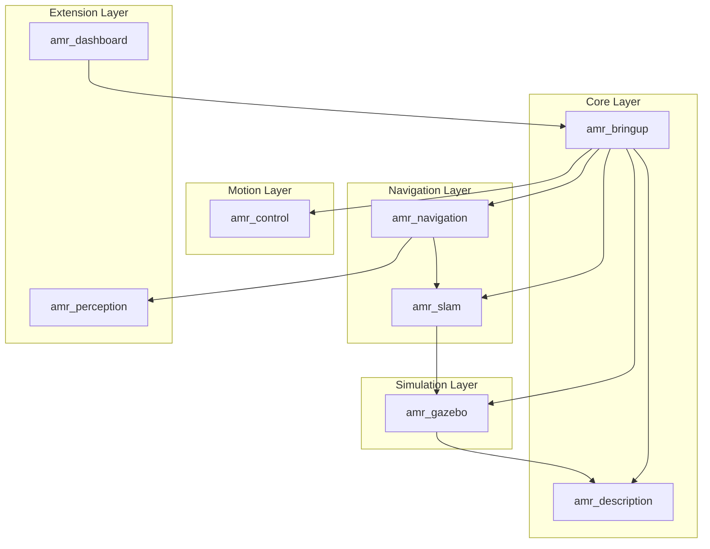

# System Architecture

This document describes the architecture of the ROS2 Autonomous Mobile Robot (AMR) platform. It reflects the **planned** system design; implementation progresses sprint by sprint.

## Design Goals

- **Modularity:** One ROS2 package per capability domain.
- **Orchestration:** `amr_bringup` provides top-level launch entry points without owning business logic.
- **Standard interfaces:** Use Nav2- and SLAM Toolbox-compatible topic and frame naming.
- **Maintainability:** Parameters in YAML, launch logic in Python launch files, robot model in Xacro.
- **Extensibility:** Perception and dashboard packages reserved for future milestones.

## Robot Platform

| Property | Specification |
|----------|---------------|
| Locomotion | Differential drive |
| Wheels | Two driven wheels + one passive caster |
| Primary sensors (planned) | 2D LiDAR, IMU |
| Simulation (Sprint 2+) | Gazebo Classic on ROS2 Humble |

## Package Map



## Package Responsibilities

| Package | Layer | Responsibility |
|---------|-------|----------------|
| `amr_description` | Core | URDF/Xacro robot model, meshes, RViz configuration |
| `amr_bringup` | Core | Top-level launches, parameter aggregation, system composition |
| `amr_gazebo` | Simulation | Gazebo world, robot spawn, sensor plugins |
| `amr_control` | Motion | Velocity command interface, differential-drive control, teleoperation |
| `amr_slam` | Navigation | SLAM Toolbox integration, map save/load |
| `amr_navigation` | Navigation | Nav2 stack, costmaps, planners, behavior trees |
| `amr_perception` | Extension | Sensor fusion, obstacle detection, costmap plugins |
| `amr_dashboard` | Extension | Operator monitoring, mission UI, diagnostics visualization |

## Planned TF Tree

```
map
 └── odom
      └── base_footprint
           └── base_link
                ├── laser_link
                └── imu_link
```

Frame naming follows [REP-105](https://www.ros.org/reps/rep-0105.html) conventions.

## Planned Topic Graph

| Topic | Message Type | Publisher (planned) | Consumer (planned) |
|-------|--------------|---------------------|-------------------|
| `/scan` | `sensor_msgs/LaserScan` | Gazebo LiDAR plugin | SLAM, Nav2, perception |
| `/imu` | `sensor_msgs/Imu` | Gazebo IMU plugin | Localization (optional fusion) |
| `/odom` | `nav_msgs/Odometry` | Diff-drive controller | SLAM, Nav2 |
| `/cmd_vel` | `geometry_msgs/Twist` | Teleop, Nav2 | Diff-drive controller |
| `/map` | `nav_msgs/OccupancyGrid` | SLAM Toolbox | Nav2 |

## Launch Hierarchy (planned)

```
amr_bringup/
├── display.launch.py       # Robot model + RViz (Sprint 1)
├── gazebo.launch.py        # Simulation + sensors (Sprint 2)
├── control.launch.py       # Teleoperation + odometry (Sprint 3)
├── slam.launch.py          # Mapping (Sprint 4)
├── navigation.launch.py    # Nav2 (Sprint 5)
└── full_system.launch.py   # Composed stack
```

## Dependency Direction

Dependencies flow **inward toward core packages**, never cyclically:

1. `amr_description` — no dependency on other `amr_*` packages.
2. `amr_gazebo`, `amr_control`, `amr_slam`, `amr_navigation` — depend on `amr_description` and/or `amr_bringup`.
3. `amr_perception`, `amr_dashboard` — depend on running system packages; must not create circular build dependencies.

## Sprint Alignment

| Sprint | Packages activated |
|--------|-------------------|
| 0 | All packages scaffolded (structure only) |
| 1 | `amr_description`, `amr_bringup` |
| 2 | `amr_gazebo` |
| 3 | `amr_control` |
| 4 | `amr_slam` |
| 5 | `amr_navigation` |
| 6+ | `amr_perception`, `amr_dashboard` |

See [milestones.md](milestones.md) for detailed acceptance criteria.
